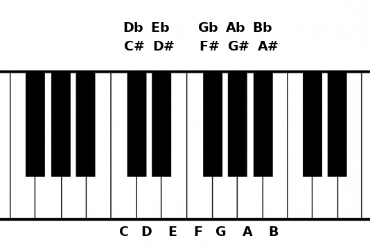
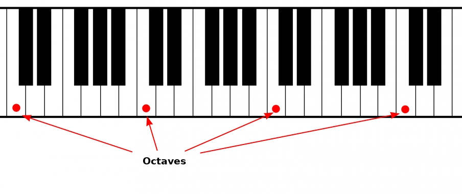

# First step: Get a random note

## Theory

There are 12 notes in occidental music theory, 7 natural and 5 altered:
```
Natural: C, D, E, F, G, A, B
Altered: C#, D#, F#, G#, A#
```
Each notes are separated by a semitone. If you look at a piano board, the white keys are the natural notes and the black keys the altered:



A sharp (`#`) means that the base note is a semitone higher, so `A#` is a semitone higher than `A`.

A flat (`b`) means that the base note is a semitone lower, so `Bb` is a semitone lower than `B`.

`A#` and `Bb` are enharmonic, it means that they produce the same sound.

If you increase (or decrease) a note by 12 semitones, you'll have the same note but with a higher (or lower) pitch, these notes are called octaves.



## Code

Like I said before, some notes produce the same sound, so I will represent only sharp notes and not flat ones to simplify.

```fsharp
type Note =
    | C | CSharp
    | D | DSharp
    | E
    | F | FSharp
    | G | GSharp
    | A | ASharp
    | B

module Note =
    let all = [
        C; CSharp
        D; DSharp
        E
        F; FSharp
        G; GSharp
        A; ASharp
        B
    ]
```

The type `Note` is a union type which mean 
> It's either `A` or `ASharp` or `B` or ...

The `Note` module lists all the functions and values related to the concept of `Note`. `all` is the list of all possible `Note`.

Now, I want to choose a random note:

```fsharp
open System

let random = Random()
let randomIndex = random.Next(0, Note.all.Length)
let randomNote = Note.all.[randomIndex]
```

`randomNote` is the note at a random index between 0 and 11 in the `Note.all` list. FSI shows the random note, but a fancier representation will be better:

```fsharp
module Note =
    let name note =
        match note with
        | CSharp -> "C#"
        | DSharp -> "D#"
        | FSharp -> "F#"
        | GSharp -> "G#"
        | ASharp -> "A#"
        | n -> string n

    // other functions and values

// previous code with randomNote

printfn "Chosen note: %s" (Note.name randomNote)
```

`match ... with` is a pattern match, it's like a (very) powerful `switch`. So `name` works like this:
- If it's a sharp note, return `"...#"`
- Else return the string representation of the note

Then the `printfn` function write in the console:
```
Chosen note: F#
```

You can also use the `|>` operator to simplify the code:
```fsharp
randomNote
|> Note.name
|> printfn "Chosen note: %s"
```

This operator is like the `|` operator in Unix, it takes the value on its left and passes it as the last argument of the function on its right:
```fsharp
let increment x = x + 1

increment 2 // returns 3

3 |> increment // returns 4
```

It is a powerful operator which is used a lot in F#.

## Conclusion

That's all for this step. You can check out the full code [here]().

Next step: [The Major scale]()