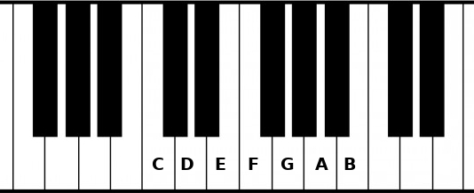

# Second step: List all the notes of the major scale

This is the second part of the music theory in F# series:
- [Introduction]()
- Step 1: [Random note]()
- Step 2: The Major scale


## Theory

There are 12 notes in an octave, but if I play random notes, the sound of the melody will closer to a piano that fells down the stairs than a Beethoven sonata. Fortunately, scales will help us.

The most famous scale is the major scale. A scale has a starting note named **root** and other notes after it. In example the C major scale is:

> C, D, E, F, G, A, B ([Listen](https://upload.wikimedia.org/score/1/4/149hxowm0jnjun0byp4xzvq7h12ndfg/149hxowm.mp3))

A scale is defined by the intervals between each notes. To create a major scale, choose a root note and add these intervals:

> Whole tone, semitone, whole tone, whole tone, whole ton, semitone

For instance, to create a C major:
```
Root:    C
Second:  D = C + 2 semitones
Third:   E = D + 2 semitones
Fourth:  F = E + 1 semitone
Fifth:   G = F + 2 semitones
Sixth:   A = G + 2 semitones
Seventh: B = A + 2 semitones
Octave:  C = B + 1 semitone
```



Each note of the scale is named after its position (root, second, third...). You can now create any major scale by applying these intervals. Here is another example, E major:
```
Root:    E
Second:  F# = E  + 2 semitones
Third:   G# = F# + 2 semitones
Fourth:  A  = G# + 1 semitone
Fifth:   B  = A  + 2 semitones
Sixth:   C# = B  + 2 semitones
Seventh: D# = C# + 2 semitones
Octave:  E  = D# + 1 semitone
```

And so on...

## Code

We can start by designing the `MajorScale` type and its module.

```fsharp
type MajorScale = MajorScale of Note

module MajorScale =
    let private intervals = [ 2; 2; 1; 2; 2; 2; 1 ]
```

Remember the union type for the `Note` type? It can be seen as an enum, but unions are more than that because each case can have its own data:
```fsharp
type Shape =
    | Point
    | Square of int
    | Rectangle of int * int // int * int is the type for a tuple of int and int

// All these values are Shape
let point = Point
let square = Square 3
let rect = Rectangle (4, 5) // (4, 5) is a value for a tuple of int and int
```

Well, `MajorScale` is a single union. It's a trick to wrap a type into another one with a clear intention. More explanations in [this article](https://fsharpforfunandprofit.com/posts/designing-with-types-single-case-dus/).

`private` means that the `intervals` value cannot be seen outside the module.

Now we want a `notes` function that takes a `MajorScale` and return the list of its `Notes`. In the theory part, we saw that the algorithm to find all the notes behave like this:
```
Return the root note
foreach interval in intervals
    return the previous note + interval
```

This function already exists, it is called `List.scan`. It takes 3 parameters:
- The list to iterate (`intervals`)
- The starting point (`root note`)
- The function to compute the new value from the current item and the previous value (`previous note` + `interval`)

```fsharp
module MajorScale =
    let private intervals = [ 2; 2; 1; 2; 2; 2; 1 ]

    let notes (MajorScale root) =
        let addSemitones note interval = // not implemented yet

        intervals
        |> List.scan addSemitones root

// expected behavior
let cMajorNotes = MajorScale C |> notes //  [ C; D; E; F; G; A; B ]
```

The function `notes` takes a `MajorScale` as parameter and destructures it. By doing this, we can easily access to `root` of the scale.

Then `addSemitones` is a function that takes a note and an interval and return the new note:
```fsharp
// expected behavior
let dSharp = addSemitones D 1 // DSharp
```

With this function implemented, `notes` called on a `MajorScale C` will return:
```fsharp
[ C; D; E; F; G; A; B; C ]
```

`C` appears two times because the last interval `1` is the interval from the seventh to the octave. We don't need it to get all the notes, so we can remove the last interval:
```fsharp
module MajorScale =
    let private intervals = [ 2; 2; 1; 2; 2; 2; 1 ]

    let notes (MajorScale root) =
        let addSemitones note interval = // not implemented yet

        intervals
        |> List.take (intervals.Length - 1)
        |> List.scan addSemitones root
```

Let's implement `addSemitones`:

```fsharp
module Note =
    let addSemitones note semitones =
        // find the index where the item of the list equals note
        let index =
            all
            |> List.findIndex ((=) note)
        
        // add the semitones to the index
        // and get only the rest of the division
        let newIndex = (index + semitones) % all.Length

        all[newIndex]
```

and call this function in the `notes` function:
```fsharp
module MajorScale =
    let notes (MajorScale root) =
        intervals
        |> List.take (intervals.Length - 1)
        |> List.scan Note.addSemitones root
```

At the end of the script, we can print the notes of the scale:
```fsharp
// Add this helper on top of the file, just after the open statements
module String =
    let joinWith (separator: string) (strings: string list) =
        String.Join(separator, strings)

MajorScale randomNote
|> MajorScale.notes
|> List.map Note.toString
|> String.joinWith ", "
|> printfn "Notes of the major scale: %s"

// With randomNote = C, it prints:
// Notes of the major scale: C, D, E, F, G, A, B 
```

Yay, now we can play random notes in this scale and it sound good!

## Conclusion

That's all for this step. You can check out the full code [here](https://github.com/cmoinard/FsMusicTheory/blob/main/Scripts/02_MajorScale.fsx).

Next step: [The chords of the Major scale]()