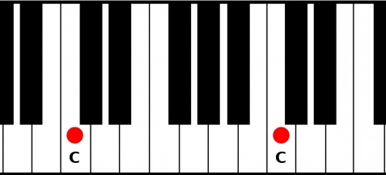
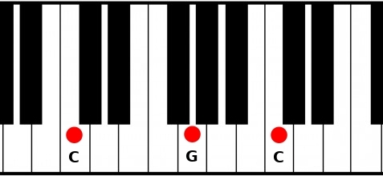
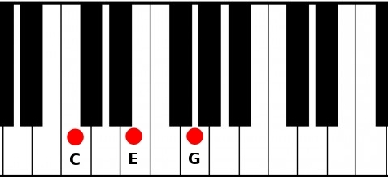
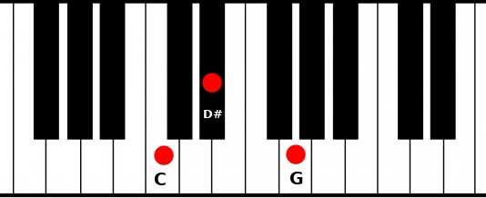

# Third step: The chords of the Major scale

## Theory

Imagine, you found a good melody in C Major, great! It can be a good idea to have some chords around it.

First idea, you can play octaves on top of your melody, but play only notes in your scale.



Octaves are OK but they feel a bit hollow. That's OK if you want this kind of feeling in your song.

If you want some consistency, octaves may not be the best choice. Just add the fifth and your chord will gain some power! How do you create these power chords? Choose a note and add 7 semitones:

```
C power chord (also noted C5)
Root:  C
Fifth: G (C + 7 semitones)

D5
Root:  D
Fifth: A (D + 7 semitones)

...
```

These power chords are used a lot in [rock, punk and metal](https://www.youtube.com/watch?v=XabBTTY1YiI).



Power chords are great and powerful, but they miss something, we can't say if they are joyful or sad. For that, add the third to your power chord.

If the third is 4 semitones away from the root, this third is called major third, and the chord is a major chord. Major chords sounds joyful, they are noted with the name of the root. So the `C` chord is a C Major.


If the third is 3 semitones away from the root, this third is called minor third, and the chord is a minor chord. Minor chords sounds sad, they are noted with a little `m`. So `Cm` is a C minor.


Here are some examples:

```
C Major (C)
Root:  C
Third: E (C + 4 semitones)
Fifth: G (C + 7 semitones)

C Minor (Cm)
Root:  C
Third: D# (C + 3 semitones)
Fifth: G  (C + 7 semitones)

A minor (Am)
Root:  A
Third: C (A + 3 semitones)
Fifth: E (A + 7 semitones)

F# minor (F#m)
Root:  F#
Third: A  (F# + 3 semitones)
Fifth: C# (F# + 7 semitones)
```

OK, we know octaves, power chords, Major chords and minor chords, but can we play any chord we want on top of our song? We can, but it can sound strange and maybe dissonant. If your melody is made with C, E and G and you play a C minor (made with C-D#-G) chord on it, you will play at the same time the E from your melody and the D# from your Cm chord. D# and E are just a semitone away frow each other, if you play them at the same time, it will sound [really dissonant](https://www.youtube.com/watch?v=aBqedxJeLW0). But it can be [awesome](https://youtu.be/YeTNkPXRrVY?list=PL_9gWeiShHFHzpU20PyVHiawAuPCJH9qH&t=353) to create a lot of tension.

A better option to avoid dissonance is to use only the notes of your scale. If you are in C Major, choose one note as the chord root, add the third note of the scale from this chord root and then add the fifth note of the scale from this chord root:

```
C Major scale : C, D, E, F, G, A, B

The chord with a C root will be:
Root:  C
Third: E (third note from the C)
Fifth: G (fifth note from the C)
There are 4 semitones between the C and the E, so the third is Major.
The C chord in a C Major scale is a C Major (noted C).
```
[C chord in C Major scale](./Images/CMajorChordInCMajorScale.jpg)

```
The chord with a D root will be:
Root:  D
Third: F (third note from the D)
Fifth: A (fifth note from the D)
There are 3 semitones between the D and the F, so the third is Minor.
The D chord in a C Major scale is a D minor (noted Dm).
```
[Dm chord in C Major scale](./Images/DMinorChordInCMajorScale.jpg)

So in the C Major scale, you have these chords:
1. C
2. Dm
3. Em
4. F
5. G
6. Am
7. ???

Beware of the 7th chord, it is special:

```
C Major scale : C, D, E, F, G, A, B

The chord with a B root will be:
Root:  B
Third: D (third note from the B)
Fifth: F (fifth note from the B)
There are 3 semitones between the B and the D, so the third is minor.
BUT there are only 6 semitones between the B and the F, the fifth is not perfect (7 semitones away from the root), it is a diminished fifth.
The B chord in a C Major scale is a B diminished (B° or Bdim).
```

[B° chord in C Major scale](./Images/BDiminishedChordInCMajorScale.jpg)

Diminished chords sounds weird because of this diminished fifth, it is [spicy, uncomfortable](https://upload.wikimedia.org/score/3/u/3uiypj1r77macnj0pt9ufpuzzld435f/3uiypj1r.mp3). It is great if you want this feeling in your song, but I you don't, you can avoid it.

Now we know all the chords of C Major:
1. C
2. Dm
3. Em
4. F
5. G
6. Am
7. B°

We can generalize this to any Major scale, each position is called a degree and can be Major, minor or diminished. Major degree are upper case, minor and diminished degrees are lower case:
```
1. Major      (noted I)
2. minor      (noted ii)
3. minor      (noted iii)
4. Major      (noted IV)
5. Major      (noted V)
6. minor      (noted vi)
7. diminished (noted vii°)
```

For any Major scale, list all the notes in it and apply the chord type (Major, minor, diminished) of its corresponding degrees to find all the chords you can play:
```
E Major scale:
E, F#, G#, A, B, C#, D#

Chords:
| Degree | Chord | Root-Third-Fifth |
|--------|-------|------------------|
| I      | E     | E    G#    B     |
| ii     | F#m   | F#   A     C#    |
| iii    | G#m   | G#   B     D#    |
| IV     | A     | A    C#    E     |
| V      | B     | B    D#    F#    |
| vi     | C#m   | C#   E     G#    |
| vii°   | D#°   | D#   F#    A     |
```

To build a chord progression, it is a good idea to start with the first degree and insist on it, the listener will understand that this chord is the root, it will feel like home. Then play any chord you want.

One more thing, these degrees are really important because some chords progressions work better than others, they are called cadences. Finishing your chord progression with the V degree and starting again with the I degree work really well. This is called a perfect authentic cadence. There are a lot of [existing cadences](https://en.wikipedia.org/wiki/Cadence).

One of the most known chord progression is the [I-V-vi-IV](https://en.wikipedia.org/wiki/I%E2%80%93V%E2%80%93vi%E2%80%93IV_progression), this was this progression in the famous [Axis of awesome - 4 chords song](https://www.youtube.com/watch?v=5pidokakU4I).

## Code

### Chord

Just after the `Note` module, we'll add the `ChordType` type:

```fsharp
type ChordType =
    | Major
    | Minor
    | Diminished
module ChordType =
    let fromIntervals intervals =
        match intervals with
        | [4; 7] -> Major
        | [3; 7] -> Minor
        | [3; 6] -> Diminished
        | _ -> invalidOp "Unknown interval"
```

`fromIntervals` is a function that returns the `ChordType` depending on a list of intervals. Pattern matching works well with lists, so if there is intervals of 4 and 7 semitones, the chord is Major, and so on. We know only three types of chords so any other form of `intervals` will throw an `InvalidOperationException`. [Exceptions may not be the best way to handle errors in a functional language](https://fsharpforfunandprofit.com/rop/) but it is simpler to explain.

We could be more strict by modeling this way:
```fsharp
type ThirdType =
    | MinorThird
    | MajorThird

type FifthType =
    | PerfectFifth
    | DiminishedFifth

type ChordType =
    | Major
    | Minor
    | Diminished
    | MajorFlat5

// Tuple of ThirdType AND FifthType
type TriadType = ThirdType * FifthType

module ChordType =
    let fromIntervals triadType =
        match triadType with
        | MajorThird, PerfectFifth -> Major
        | MinorThird, PerfectFifth -> Minor
        | MajorThird, DiminishedFifth -> MajorFlat5
        | MinorThird, DiminishedFifth -> Diminished
```

It is more strict and there can't be any error by design, but there are a lot more other chord types (Major 7, Minor 7, half diminished, sus2, sus4, inversions...). That's why `intervals` is just a list of `int` and not a stricter type.

Let's forgot this stricter approach a keep the code with the `int list`.

Now the `Chord` type. A chord is defined by the root `Note` and a `ChordType`.

```fsharp
// Just after ChordType
type Chord = Chord of Note * ChordType
module Chord =
    let name (Chord (root, chordType)) =
        let note = root |> Note.name
        match chordType with
        | Major -> note
        | Minor -> $"{note}m"
        | Diminished -> $"{note}°"
```

`Chord` is a single union-case, like the `MajorScale` in the [previous part of the serie](). It is composed by a tuple of `Note` and `ChordType`.

The `name` function takes a `Chord` and deconstructs it to have access to the `root` and the `chordType`.

### Degree

`Degree` implementation is very close to `Chord` because it is an abstraction of a chord in any major scale.

```fsharp
// Just after Chord

type DegreeName = I | II | III | IV | V | VI | VII
module DegreeName =
    let all = [ I; II; III; IV; V; VI; VII ]

type Degree = Degree of DegreeName * ChordType
module Degree =
    let name (Degree (degreeName, chordType)) =
        let romanName = string degreeName
        match chordType with
        | Major -> romanName
        | Minor -> romanName.ToLower()
        | Diminished -> $"{romanName.ToLower()}°"
```

### Chords of the scale

We don't know how to implement it for now, but we know its signature:
```fsharp
module MajorScale =
    // Other functions

    let chords (scale: MajorScale): (Degree * Chord) list =
        []

// Expected behavior
let degreesAndChords =
    MajorScale C
    |> MajorScale.chords

let expectedContent =
    [
        I,   Chord (C, Major)
        II,  Chord (D, Minor)
        III, Chord (E, Minor)
        IV,  Chord (F, Major)
        V,   Chord (G, Major)
        VI,  Chord (A, Minor)
        VII, Chord (B, Diminished)
    ]
```


We saw that the degrees of the Major scale are:
> I, ii, iii, IV, V, vi, vii°

So we can zip the degrees with the notes of the scale:
```fsharp
module MajorScale =
    // Other functions

    let private degrees = [
        Degree (I,   Major)
        Degree (II,  Minor)
        Degree (III, Minor)
        Degree (IV,  Major)
        Degree (V,   Major)
        Degree (VI,  Minor)
        Degree (VII, Diminished)
    ]

    let chords (scale: MajorScale): (Degree * Chord) list =
        scale
        |> notes
        |> List.zip degrees
        |> List.map (fun (degree, note) ->
            let (Degree (_, chordType)) = degree

            degree, Chord (note, chordType)
        )
```

`List.zip` combine the first element of the two lists, then the second element of the two lists, and so on:
```fsharp
let numbers = [1; 2; 3]
let strings = [ "foo"; "bar"; "baz" ]

let zipped = List.zip numbers strings

let expected = [
    1, "foo"
    2, "bar"
    3, "baz"
]
```

`List.zip` here will return a `(Degree * Note) list`. Then we have to map each tuple to return the `Degree * Chord` depending on the `Note` and on the `ChordType` of the `Degree`.

`List.map` takes a function `'a -> 'b` and a `'a list` and returns a `'b list`. `'a` and `'b` are generic type and in F#, they start with a `'`.

```fsharp
let increment x = x + 1

// [2; 3; 4]
let incrementedNumbers =
    [1; 2; 3]
    |> List.map increment

// [2; 4; 6]
let incrementedNumbers =
    [1; 2; 3]
    |> List.map (fun i -> i * 2)
```

`List.zip` returns a tuple, so the parameter of the lambda should be deconstructed by writing `fun (degree, note) -> ...`. It means that this lambda takes one argument which is a deconstructed tuple.

For each tuple, we deconstruct the `Degree` to extract the `ChordType` and then we can return a `Degree * Chord`.

This `List.zip` followed by `List.map` can be refactored with `List.map2`:
```fsharp

module MajorScale =
    // Other functions

    let private degrees = [
        Degree (I,   Major)
        Degree (II,  Minor)
        Degree (III, Minor)
        Degree (IV,  Major)
        Degree (V,   Major)
        Degree (VI,  Minor)
        Degree (VII, Diminished)
    ]

    let chords (scale: MajorScale): (Degree * Chord) list =
        let degreeChord degree note =
            let (Degree (_, chordType)) = degree
            degree, Chord (note, chordType)

        List.map2
            degreeChord
            degrees
            (notes scale)
```

At the end of the script, we can print the chords of the scale:
```fsharp
// Show the chords of the scale
MajorScale randomNote
|> MajorScale.chords
|> List.iter (fun (degree, chord) ->
    let degreeName = Degree.name degree
    let chordName = Chord.name chord
    printfn "%-4s: %s" degreeName chordName
)
```

`List.iter` executes a function for each element. To print `Degree * Chord` we use `printfn` with the `%-4s` which means:
> it's a string that takes exactly 4 characters and is left-aligned

## Conclusion

That's all for this step. You can check out the full code [here](https://github.com/cmoinard/FsMusicTheory/blob/main/Scripts/03_Chords.fsx).

Next step: [Modes of the Major scale]()